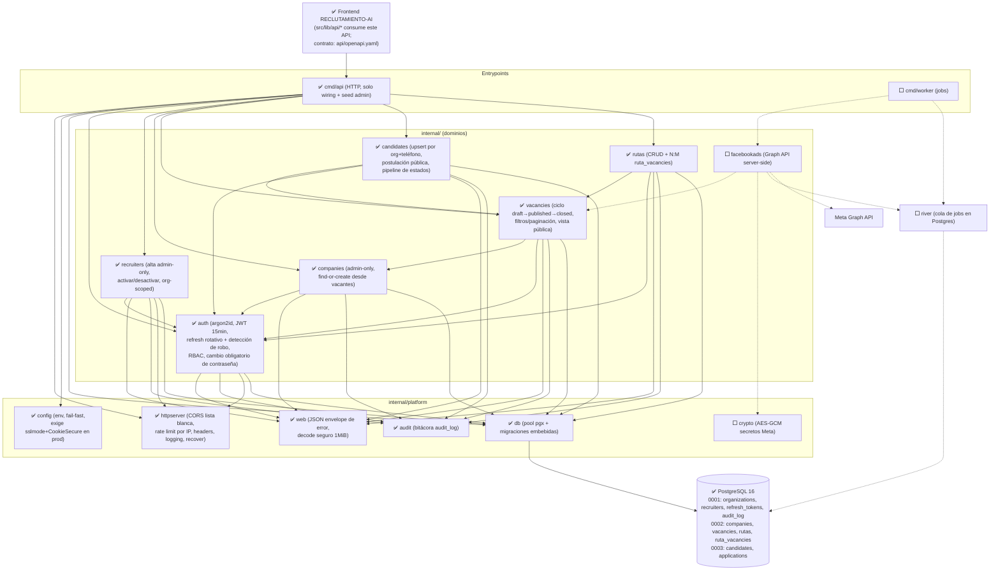

# Jobbly Backend — Instrucciones para Claude Code

Backend en **Go + PostgreSQL** del sistema de reclutamiento Jobbly.
Plan maestro: `../PLAN_DE_ACCION.md` (arquitectura, esquema de DB, fases y criterios de entrega).

---

## Regla obligatoria: Grafo del proyecto

1. **ANTES de crear, editar, refactorizar o eliminar código**: leer el grafo de la sección
   "Grafo del proyecto" (abajo en este mismo archivo) para entender dependencias e
   impacto del cambio. Si vas a tocar un nodo, revisa primero quiénes dependen de él.
2. **DESPUÉS de cada cambio** (paquete nuevo, import nuevo/eliminado, archivo borrado o
   renombrado, nueva tabla/migración, nuevo endpoint, nuevo job): actualizar el grafo en
   este archivo para que siempre refleje el estado real del código. Un cambio sin grafo
   actualizado es un cambio incompleto y no se commitea.

---

## Grafo del proyecto

> Última actualización: 2026-06-10 — Fases 1, 2 y 3 implementadas y verificadas
> end-to-end (auth, reclutadores, compañías, vacantes, rutas, candidatos y
> postulaciones). Lo ⬜ es lo que falta (PLAN_DE_ACCION.md) y se marca ✅ al construirse.

Estado de nodos: ⬜ planeado · ✅ implementado

### Reglas de dependencia vigentes

- `vacancies` usa `companies.FindOrCreate` (nunca al revés); `candidates` y
  `rutas` referencian vacantes por id validando organización.
- Endpoints públicos (`/api/v1/public/*`): solo lectura de vacantes publicadas
  y `POST /applications` con rate limit estricto (10/min por IP); jamás
  exponen datos org-internos.

Endpoints vivos (todos verificados con tests + navegador real):
`POST /auth/login|refresh|logout|change-password` · `GET /auth/me` ·
`GET|POST /recruiters` · `PATCH /recruiters/{id}` ·
`GET|POST /companies` · `PATCH /companies/{id}` ·
`GET|POST /vacancies` · `GET|PATCH /vacancies/{id}` ·
`GET /candidates` · `GET /applications` · `PATCH /applications/{id}` ·
`GET|POST /rutas` · `PATCH|DELETE /rutas/{id}` ·
`GET /public/vacancies` · `GET /public/vacancies/{id}` · `POST /public/applications` ·
`GET /healthz` · `GET /readyz`

### Reglas de dependencia (se validan al revisar el grafo)

- Los dominios de `internal/` **no se importan en círculo**; las dependencias permitidas
  son las flechas del grafo (ej. `vacancies` puede usar `positions`, nunca al revés).
- `internal/platform/*` no importa ningún dominio (capa base).
- Solo `facebookads` habla con Meta; ningún otro paquete construye URLs de Graph API.
- Solo `auth` toca hashing/tokens; ningún dominio maneja contraseñas por su cuenta.
- `cmd/*` solo ensambla (wiring); cero lógica de negocio en `main.go`.

### Tabla de impacto (si tocas X, revisa Y)

| Si modificas | Revisar / afecta a |
|--------------|--------------------|
| `internal/platform/db` | Todos los dominios (todos consultan por aquí) |
| `internal/auth` | Middleware de TODOS los endpoints protegidos + `recruiters` |
| `migrations/` (esquema) | Queries sqlc del dominio afectado + `DATABASE_VARIABLES.md` del frontend + OpenAPI |
| `api/openapi.yaml` | Frontend (`../RECLUTAMIENTO-AI`) — avisar/ajustar el cliente API |
| `internal/facebookads` | Jobs del worker + config cifrada (`crypto`) |
| Enums (`permission`, `work_mode`, `requested_sex`, status) | Migración + validadores + frontend |

---

## Regla obligatoria: Nada de APIs a medias (Definition of Done)

Una feature solo se considera terminada cuando incluye **todo** lo siguiente:

1. Migración SQL (`migrations/`) si toca el esquema
2. Endpoint con validación de entrada y manejo de errores completo
3. Tests (unitarios + integración contra Postgres)
4. Documentada en el contrato OpenAPI (`api/openapi.yaml`)
5. Consumida por el frontend (o issue explícito de integración creado)
6. **Grafo de este archivo actualizado**

No se mergea a `main` nada que deje un flujo a la mitad.

---

## Contexto del proyecto

- **Stack:** Go 1.24+ · chi (router) · pgx/v5 + sqlc · golang-migrate · river (jobs) · PostgreSQL 16
- **Estructura:** `cmd/api`, `cmd/worker`, `internal/<dominio>/`, `internal/platform/`, `migrations/`, `db/queries/`
- **Auth:** JWT access (15 min) + refresh token rotativo httpOnly · hashing argon2id · roles `Administrador` / `Ejecutivo`
- **Secretos de Meta (Facebook Ads):** cifrados en reposo, jamás expuestos al cliente; toda llamada a Graph API sale del backend/worker
- **Esquema de datos:** fuente de verdad en `../RECLUTAMIENTO-AI/DATABASE_VARIABLES.md` y `../PLAN_DE_ACCION.md` §2.2 — incluir `organization_id` en tablas de negocio (multi-tenancy futuro)
- **Frontend:** `../RECLUTAMIENTO-AI` (React 19 + TanStack Start); el contrato entre ambos es OpenAPI
